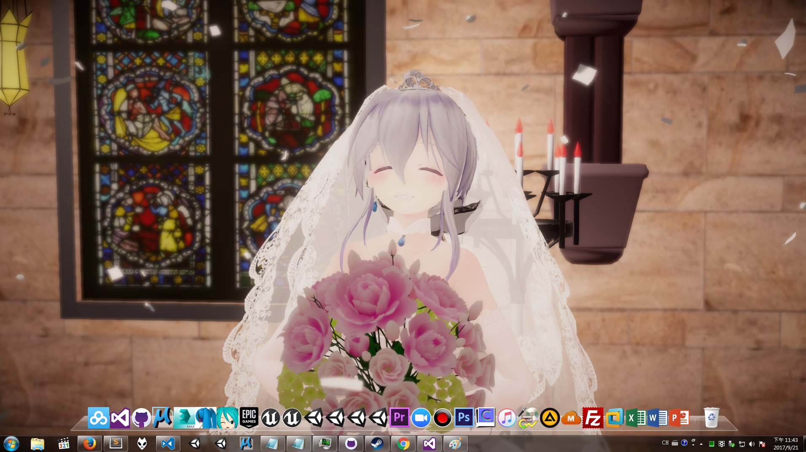

# Project-Haku-Desktop

## Preview & Video Demo

(Click to preview video on Youtube)

P.S. I record this with application only, since the record software I use drops fps while recordering :(

## Credits:

* [WallPaper Engine](http://store.steampowered.com/app/431960/Wallpaper_Engine/)

* [MMD4Mecanim](http://stereoarts.jp/)

* [TransformJitter](https://github.com/ichika292/TransformJitter) ( Leave a Star! )

* [Unity Post Processing Stacks](https://github.com/Unity-Technologies/PostProcessing) ( Leave a Star! )

* Models:

    * [TDA Haku Wedding Dress Ver 1.03 by Samsink](https://samsink.deviantart.com/art/TDA-Haku-Wedding-Dress-Ver-1-03-DOWNLOAD-564440579)
    
    * [木の教会 by にくきゅー](http://seiga.nicovideo.jp/seiga/im5662216)
    
    * [トルコキキョウ by いつものほん](http://seiga.nicovideo.jp/seiga/im5188945)
    
    * [Tadao Ando's Church Of The Light by komeil](https://free3d.com/3d-model/tadao-andos-church-of-the-light-45169.html)
    
    * if I missed anything, plz let me know!

## Download Link:

* [Click Me! (Google Drive)](https://drive.google.com/file/d/0B-hOVrfr3zH0ejRydG9ORWZxWVE/view?usp=sharing)

## Usage:

* unzip the file and place it to where your WallPaper Engine is.

* Default Path: 

    <pre>"WHERE_YOU_INSTALL_STEAM"\SteamLibrary\steamapps\common\wallpaper_engine\projects\myprojects\</pre
